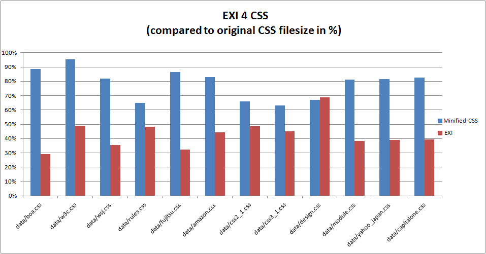

# exificient-for-css

EXI for CSS (Explorative) - How EXI can be used to represent CSS efficiently w.r.t.

* Size and
* Processing speed

[](https://travis-ci.org/EXIficient/exificient-for-css)


## Document Object Model (DOM) Style Specification

We use the [CSS Parser](http://cssparser.sourceforge.net/) which reads Cascading Style Sheets (CSS3, CSS2.1, CSS2, and CSS1) and generates
a [CSS Object Model (CSSOM)](https://www.w3.org/TR/cssom-1/).

By means of an XML schema we then efficiently represent the style information with EXI.

On the contrary the efficient representation can be transformed back to plain-text CSS, DOM Style, or alternatively provided as events.


## Sample

### CSS

```css
body {
    background-color: #d0e4fe;
}
h1 {
    color: orange;
    text-align: center;
}
p {
    font-family: "Times New Roman";
    font-size: 20px;
}
```

### CSS Object Model (visualized as XML)

```xml
<stylesheet>
    <cssStyleRule>
        <selectorText>body</selectorText>
        <style>
            <property>background-color</property>
            <cssValue>
                <cssPrimitiveValue>
                    <cssRgbColor>
                        <r>208</r>
                        <g>228</g>
                        <b>254</b>
                    </cssRgbColor>
                </cssPrimitiveValue>
            </cssValue>
        </style>
    </cssStyleRule>
    <cssStyleRule>
        <selectorText>h1</selectorText>
        <style>
            <property>color</property>
            <cssValue>
                <cssPrimitiveValue>
                    <cssIdent>orange</cssIdent>
                </cssPrimitiveValue>
            </cssValue>
            <property>text-align</property>
            <cssValue>
                <cssPrimitiveValue>
                    <cssIdent>center</cssIdent>
                </cssPrimitiveValue>
            </cssValue>
        </style>
    </cssStyleRule>
    <cssStyleRule>
        <selectorText>p</selectorText>
        <style>
            <property>font-family</property>
            <cssValue>
                <cssPrimitiveValue>
                    <cssString>Times New Roman</cssString>
                </cssPrimitiveValue>
            </cssValue>
            <property>font-size</property>
            <cssValue>
                <cssPrimitiveValue>
                    <cssPx>20.0</cssPx>
                </cssPrimitiveValue>
            </cssValue>
        </style>
    </cssStyleRule>
</stylesheet>
```


## Early Results

See test-data in https://github.com/EXIficient/exificient-for-css/tree/master/data.

### Compression


| TestCase     | CSS [Size in Bytes] | Minified CSS [Size in Bytes]  | EXI 4 CSS [Size in Bytes]  |
| ------------- | -------------:|  -------------:| -----:|
| data/boa.css	|  120184	| 106666	| 34894
| data/w3c.css	| 12714	| 12115	| 6215
| data/wsj.css	| 96605	| 79114	| 34367
| data/rules.css	| 1259	| 817	| 609
| data/fujitsu.css	| 60085	| 51979	| 19366
| data/amazon.css	| 129740	| 107724	| 57436
| data/css2_1.css	| 2855	| 1884	| 1392
| data/css3_1.css	| 521	| 328	| 234
| data/design.css	| 166	| 111	| 114
| data/module.css	| 2056	| 1670	| 785
| data/yahoo_japan.css	| 52237	| 42645	| 20329
| data/capitalone.css	| 44676	| 36883	| 17552


On average "EXI for CSS" is about 43% of the original CSS filesize!




